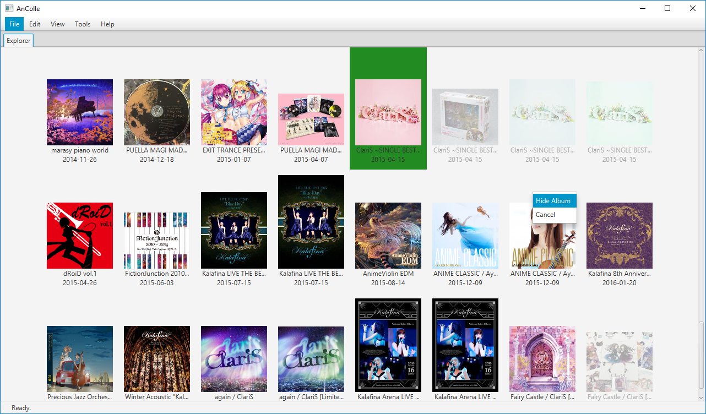

AnColle
=======

AnColle is a GUI tool for keeping track of your anime and video game music
collection. It allows you to track any products or franchises found at
[VGMdb](http://vgmdb.net/). It uses the web API found at http://vgmdb.info/ to
interface with VGMdb.

## Screenshots

## Build

This project requires JDK 8 and JavaFX, and is built using the Ant build tool.
From the project directory, running `ant` should build the project to an
executable JAR which will be placed in the `dist/` directory.
