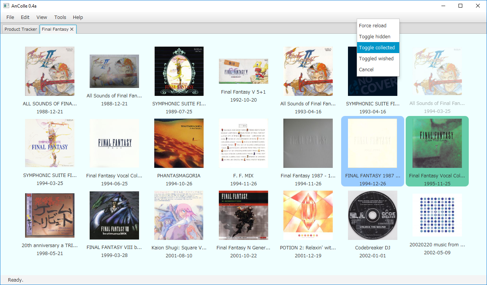

AnColle
=======

AnColle is a GUI tool for keeping track of your anime and video game music collection. It allows you to track any
products or franchises found at
[VGMdb](http://vgmdb.net/). It uses the web API found at http://vgmdb.info/ to interface with VGMdb.

## Controls

- Navigate with the mouse
- On the Product Tracker:
    - Add a product from the Product Tracker tab by clicking the "+" node, or by pressing `A`
    - Remove a product from the Product Tracker by right-clicking it and selecting
      `Remove Product`
- When viewing a product's albums (Album View):
    - `Left-Click` an album to toggle *collected* status
    - `Shift + Left-Click` an album to toggle *wished* status
    - `Ctrl + Left-Click` to open album details
    - `Middle-Click` an album to open album details in the background
    - `Right-Click` an album for a context menu
- On any tab but the Product Tracker:
    - `Ctrl + W` to close the current tab
- Visibility of hidden items can be toggled with `View -> Show hidden items`

## Screenshots

The product tracker, populated:

Viewing a product's albums:

Viewing an album's details:

[More screenshots](doc/more-screenshots.md) | [Demo video (mp4)](doc/demo-video.mp4)

## Build

This project requires JDK 8 and JavaFX, and is built using the Ant build tool. From the project directory, running `ant`
should build the project to an executable JAR which will be placed in the `dist/` directory.

Zipped release builds can be found in the `builds/` directory.

## Common errors

`Error: Could not find or load main class` occurs when your Java does not have JavaFX bundled with it (which is the case
for OpenJDK8). Install the JavaFX package for your platform to fix this issue.

## Software Credits

This software bundles a binary of the *json-simple* library v1.1.1 for Java, which is licenced under
the [Apache 2.0 licence](https://www.apache.org/licenses/LICENSE-2.0).
